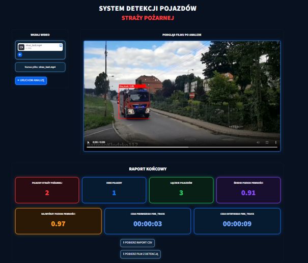

# Object Detection AI

AI-based object detection project using computer vision and machine learning.

## Project overview

This project focuses on detecting fire trucks and other road vehicles in video recordings using YOLOv8.

The project included dataset preparation, model training, hyperparameter testing and development of a Streamlit application for video analysis.

## Application preview



## Key features

- Object detection using YOLOv8
- Two classes: `fire_truck` and `other_vehicle`
- Video analysis with bounding boxes and confidence scores
- Vehicle counting and object tracking
- Configurable detection parameters
- Detection timeline
- Automatic detection snapshots
- First, best and last fire truck detection preview
- Detection confidence statistics
- CSV report generation
- Processed video export
- Streamlit user interface

## Dataset

The dataset was prepared using Roboflow.

- 684 images before augmentation
- 1,642 images after augmentation
- 681 `fire_truck` objects
- 1,475 `other_vehicle` objects

Preprocessing and augmentation included image resizing, horizontal flipping, brightness adjustment and exposure adjustment.

## Model training

The model was trained in Google Colab using Ultralytics YOLOv8.

Several configurations were tested, including different model variants, learning rates, batch sizes and weight decay values.

Final configuration:

- YOLOv8s
- 50 epochs
- image size: 640 × 640
- batch size: 16
- optimizer: SGD

The trained model was exported as `best.pt`.

## Application

A Streamlit application was developed for video-based vehicle detection and analysis.

The application allows the user to:

- upload `.mp4` video files
- run YOLOv8 object detection
- display bounding boxes and confidence scores
- count unique detected vehicles
- track objects between consecutive video frames
- adjust detection confidence
- adjust detection stability
- define minimum detected object size
- adjust tracking sensitivity using IoU
- display detection statistics
- visualize first and last confirmed detections on a timeline
- automatically capture first, best and last fire truck detection frames
- export analysis results to CSV
- download the processed video with detection boxes

## Technologies

- Python
- YOLOv8
- Ultralytics
- OpenCV
- Streamlit
- Roboflow
- Google Colab
- Pandas

## Project structure

```text
object-detection-ai/
├── app.py
├── training.py
├── best.pt
├── requirements.txt
├── images/
└── README.md
